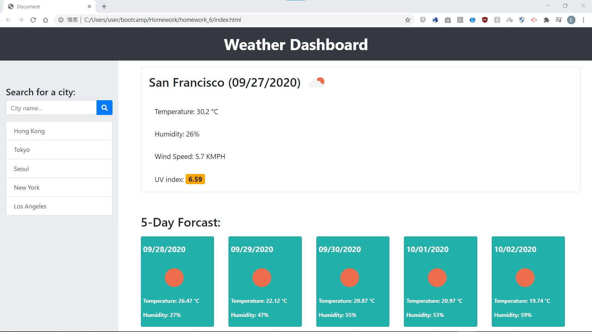
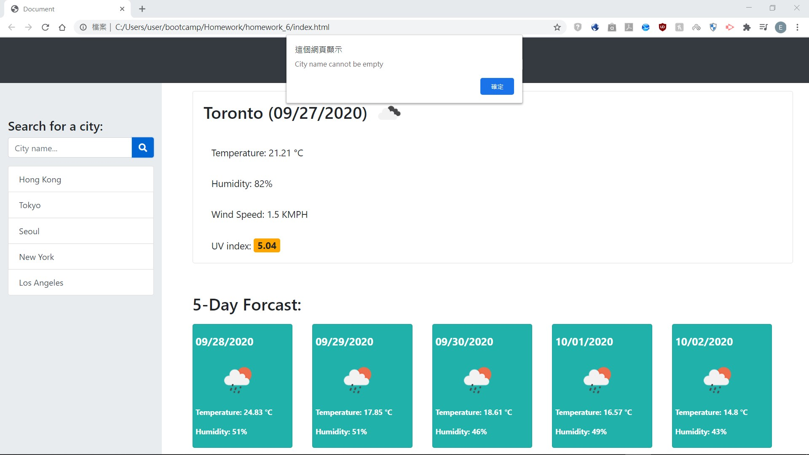
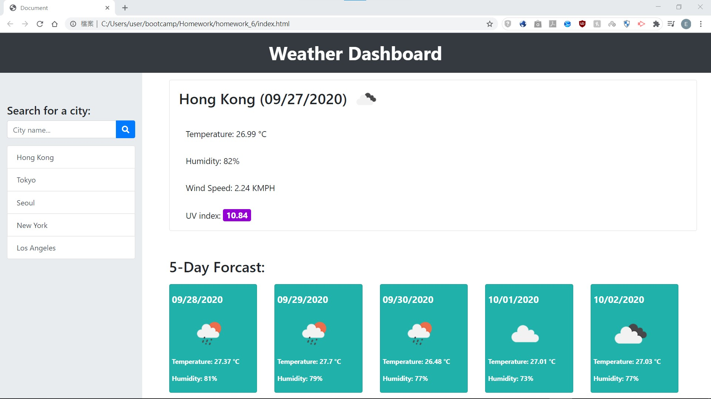

# Weather-Dashboard
Goal: To create a web app to report current's weather and forcast the next 5 days  
This project has the following abilities:
- Display current weather and 5-day forcast on screen (Default: Toronto)
- Search for a city and display its current weather and 5-day forcast on screen
- Click the buttons in sidebar and display the corresponding city's current weather and 5-day forcast on screen

 

This project contains the following files:  
- index.html: The weather dashboard with general layout of the page
- script.js: Manage display and search functionality of the page
- style.css: General styling for index.html

 

This project is made using **HTML5**, **CSS**, **Javascript**, **jQuery**, **OpenWeather API** and **moment.js** 
This project is currently hosted on Github Pages: https://elwinung0120.github.io/Weather-Dashboard/  

## script.js
- Send request to OpenWeather's Current Weather and One Call API for weather data
- Insert contents for Today's weather card using data from One Call API
- Build forcast cards using data from Current Weather and One Call API
- Manage searching function using search bar or buttons in sidebar.

## index.html

## Search using search input

### If search input is empty

## Search using buttons in sidebar

